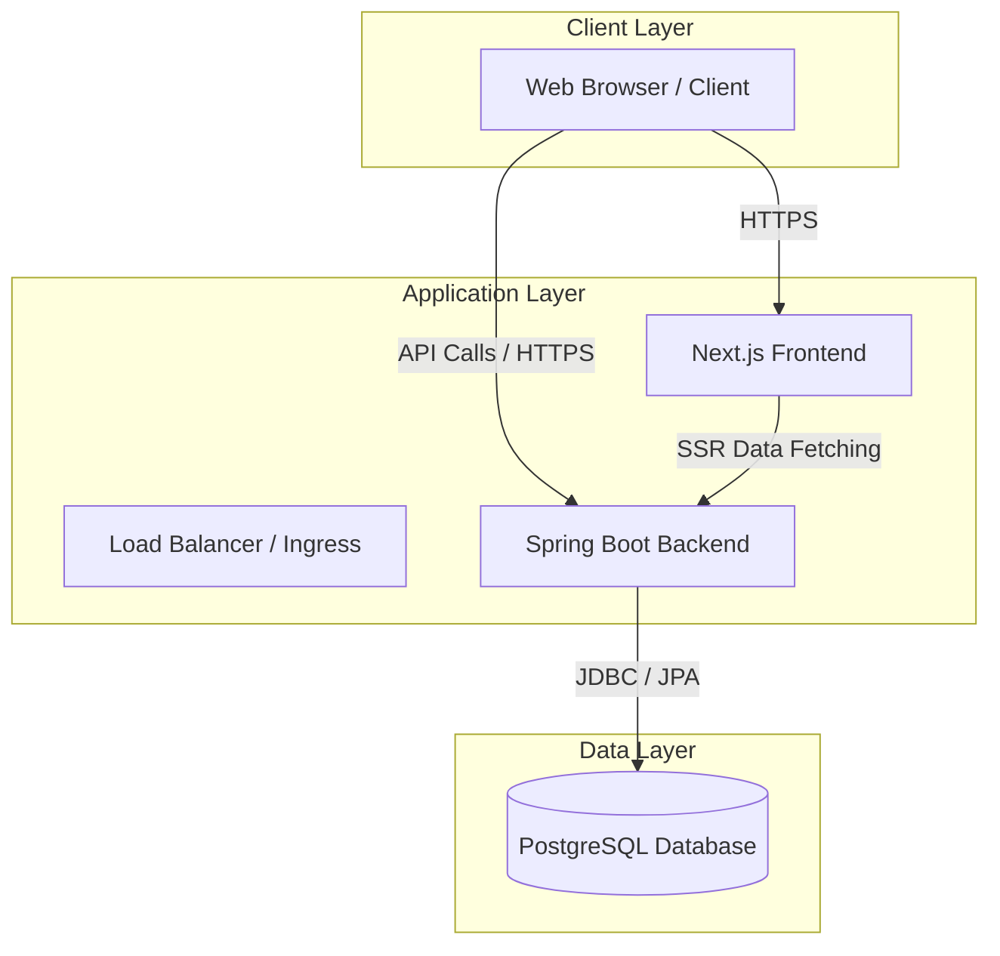
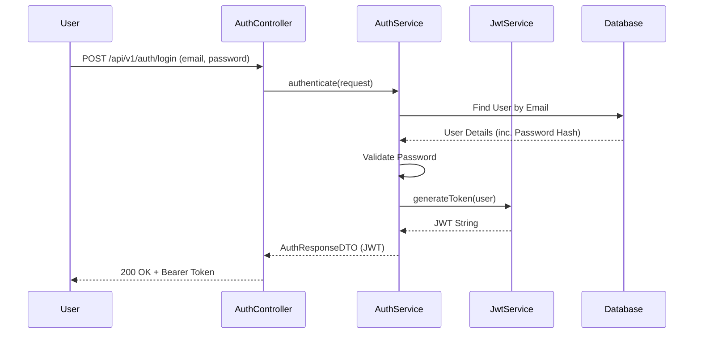
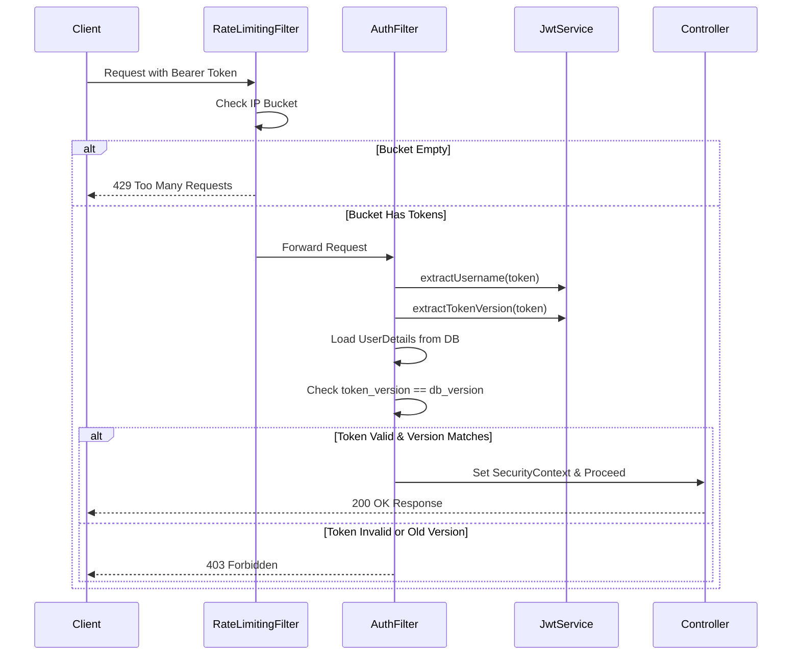
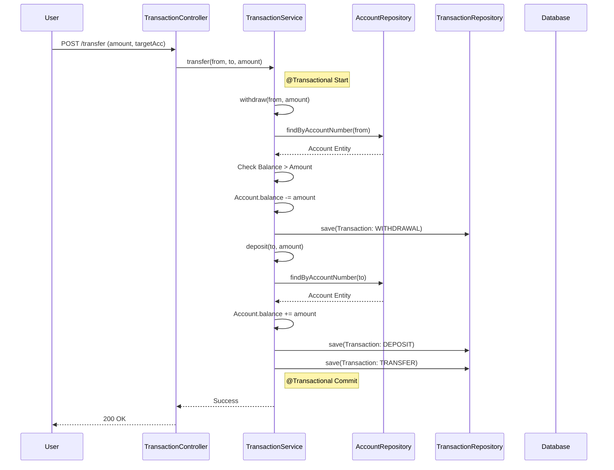
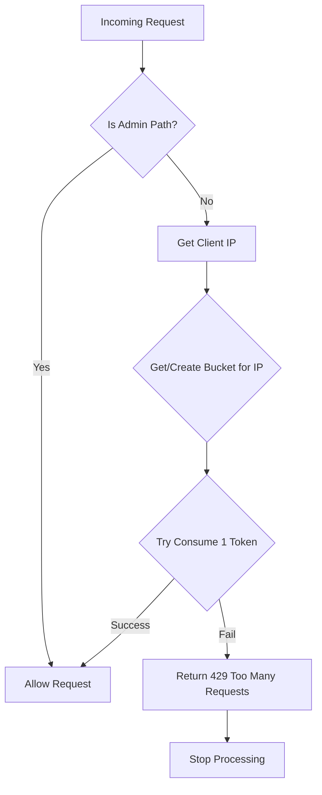
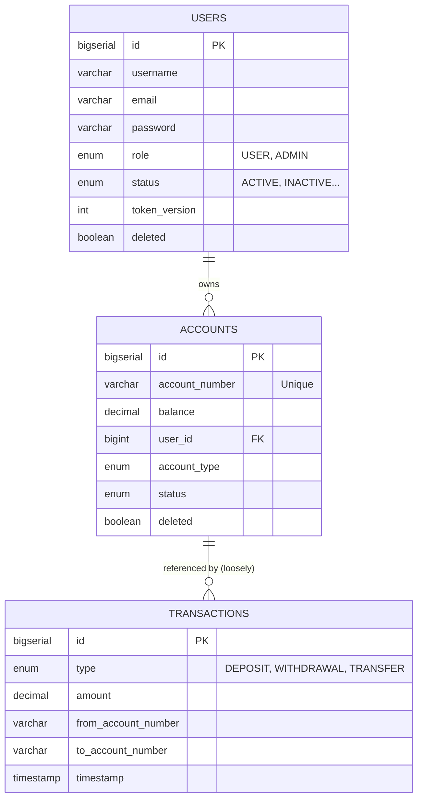

# Vaulta Architecture & Flow Analysis

This document provides a detailed analysis of the Vaulta banking platform's architecture, including request flows and database schema.

## 1. System Architecture

Vaulta follows a modern 3-tier architecture with a decoupled frontend and backend.

- **Frontend**: Next.js 16 (React 19) application interacting with the API via REST.
- **Backend**: Spring Boot 3+ (Java 21) REST Application.
- **Database**: PostgreSQL for persistent storage.

## 2. Authentication & Authorization Flow

Authentication is handled via JWT (JSON Web Tokens). The system uses **Token Versioning** to allow for immediate token invalidation (e.g., on logout or security events).

### Login Flow

### Protected Request Flow (Authorization)

## 3. Transaction Processing Flow

Transactions (Deposit, Withdrawal, Transfer) are transactional (ACID) operations ensuring data integrity. A Transfer operation is composed of a Withdrawal followed by a Deposit.

### Transfer Flow

## 4. Rate Limiting Flow

Rate limiting is implemented using **Bucket4j** via a custom `RateLimitingFilter`. It uses a Token Bucket algorithm keying off the client's IP address.

- **Limit**: 10 requests per minute.
- **Refill Strategy**: Greedy refill (smoothly adds tokens over time).
- **Scope**: Applied to all `/api/` endpoints except `/api/v1/admin/`.

## 5. Database Schema

The database uses PostgreSQL with ENUM types for strict data validation. `Flyway` handles schema versioning.

### Key Schema Notes:
- **Token Versioning**: `users.token_version` is used to invalidate JWTs server-side without a blacklist.
- **Soft Deletes**: `deleted` flag on `users` and `accounts` allows for data retention.
- **Decoupled Transactions**: The `transactions` table stores account numbers as strings (`varchar`) rather than foreign keys to `accounts.id`. This preserves transaction history even if an account is hard-deleted or archived.
